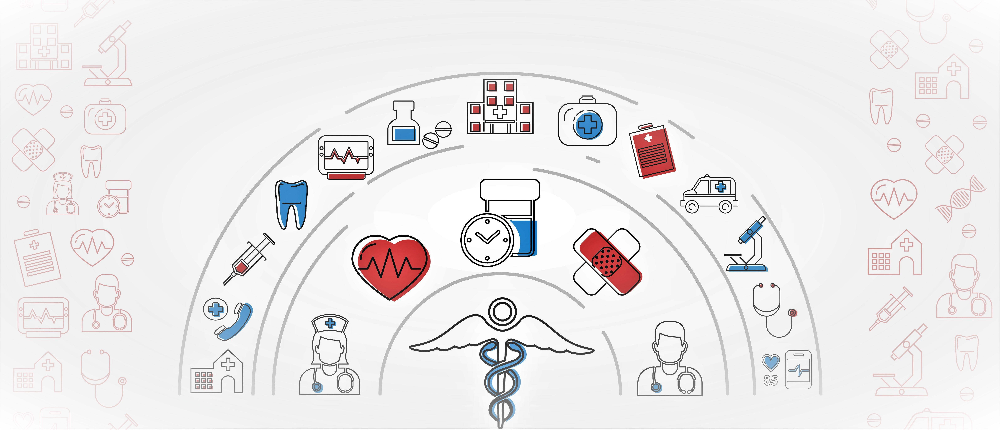

# Auto Medical Diagnosis API 🌡️🔍

## Overview 🔹

The **Auto Medical Diagnosis API** is a groundbreaking solution created for patients, allowing them to receive automated predictions about potential ailments based on their descriptions of how they're feeling. Powered by NLP (Natural Language Processing) and backed by Random Forest Classification, this API serves as a vital component of the [MedAID](https://med-app-nsut.netlify.app) ecosystem, offering efficient and accurate ailment predictions.

## Basis of the Model 🔸

The core of this API lies in its utilization of NLP techniques and the application of Random Forest Classification. By analyzing textual descriptions provided by patients, the API classifies their symptoms into a range of pre-defined ailments. Currently, the dataset encompasses various ailments, including emotional pain, hair falling out, headaches, skin issues, and many more.

## Query Structure 📝

To harness the power of the Auto Medical Diagnosis API, you need to interact with its singular endpoint: **/process**. The following parameters are essential:

- **query**: A string parameter representing the patient's description of their symptoms.
- **train**: A parameter that triggers training if set to 1; set to 0 if training is unnecessary.

## Query Example 🌐

For instance, sending the query **"I have been feeling sad and dejected for quite some time now"** results in the API returning the following list of potential ailments:

- Emotional pain
- Feeling dizzy
- Body feels weak

You can experience this firsthand by visiting our API endpoint: [Auto Medical Diagnosis API](https://medical-nlp.herokuapp.com/process?query=%22i%20have%20been%20feeling%20sad%20and%20dejected%20for%20quite%20some%20time%20now%22&train=0)

## Future Additions 🚧

We acknowledge that the current model's vocabulary may be limited due to the dataset's size (~800 data points). We're actively expanding our dataset to enhance the API's linguistic capabilities.

Additionally, we are committed to automating the training process further, eliminating the need for manual intervention. This enhancement will streamline the API's efficiency and accuracy.

## Contact Us 📞

For inquiries or collaboration opportunities, please feel free to reach out to us:

Email: warriroknightcodefreak@gmail.com

## License 📝

This project is licensed under the [MIT License](LICENSE).

---

